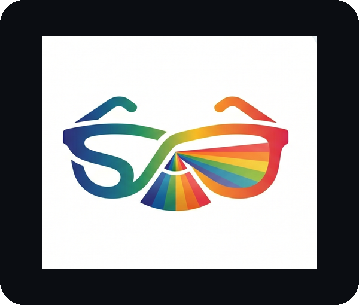

<p align="center">
  
</p>

# Spectra

**Meta's glasses SDK, minus the boilerplate and most of the suffering.**

Spectra is a Kotlin Multiplatform wrapper around [Meta's Wearables Device Access Toolkit](https://wearables.developer.meta.com/docs/develop/dat/) (DAT). It collapses the native SDK — callbacks, result builders, activity-result contracts — into one coroutine-and-`Flow` API you call from `commonMain`. Registration, permissions, device sessions, camera streaming and photo capture, the Ray-Ban Display, and Bluetooth audio (A2DP playback + HFP mic), all behind a single `SpectraClient`.

> Independent wrapper. Not affiliated with, sponsored by, or endorsed by Meta. The toolkit is a developer preview, so the API will move.

<p align="center">
  <video src="docs/demo.mp4" controls playsinline width="640"></video>
</p>
<p align="center"><em>Demo (with sound). If it doesn't play inline on GitHub, <a href="docs/demo.mp4">open the video here</a>.</em></p>

## What's in here

```
demo/
  spectra/      THE LIBRARY (KMP, publishable). Agnostic of the demo:
                commonMain (core/camera/display/mock + Spectra/SpectraClient),
                androidMain (real mwdat backend), iOS targets.
  shared/       Playground UI (Compose). Depends on :spectra — like any app would.
  androidApp/   Android entry point.
  iosApp/       iOS Xcode project — real Swift bridge (SpectraBridge.swift) wired to Wearables.shared.
docs/           Spectra Docs — a static, Vercel-ready site (index.html + llms.txt + AGENTS.md).
```

The library (`:spectra`) is standalone: it has no dependency on the demo, so any project can use it. The demo is just the first consumer. Both platforms now run the **real** backend (Android via `mwdat`, iOS via the Swift bridge) as well as the in-memory **Mock**, switchable from the demo's debug sheet. A developer-only **MockDeviceKit** simulates a Ray-Ban Meta so the whole register → session → stream pipeline runs with no hardware in the room.

## Use Spectra in your own project

Publish the library to Maven Local, then depend on it from any KMP project — no demo required:

```bash
cd demo && ./gradlew :spectra:publishToMavenLocal   # -> com.umain.spectra:spectra:0.2.0
```

```kotlin
// settings.gradle.kts of your project — add mavenLocal() and the mwdat repo
dependencyResolutionManagement {
    repositories {
        mavenLocal()
        google(); mavenCentral()
        maven {
            url = uri("https://maven.pkg.github.com/facebook/meta-wearables-dat-android")
            credentials { username = ""; password = providers.gradleProperty("github_token").orNull ?: System.getenv("GH_TOKEN") ?: "" }
            content { includeGroup("com.meta.wearable") }
        }
    }
}

// shared/build.gradle.kts of your project
kotlin { sourceSets { commonMain.dependencies { implementation("com.umain.spectra:spectra:0.2.0") } } }
// SpectraClient now also exposes `hasActiveDevice: Flow<Boolean>`, an optional
// `mockDeviceKit: MockDeviceKit?` for hardware-free testing, and an optional
// `audio: SpectraAudio?` (A2DP playback + HFP mic — plain Bluetooth, not DAT).
```

Then `Spectra.mock()` works anywhere; `Spectra.create(context, bridge)` gives the real Android client (needs the GitHub token + the manifest credentials).

## Local setup (secrets)

No credentials are committed. The real values live in gitignored files you create once:

**Android** — add to `demo/local.properties` (gitignored):

```properties
mwdat_application_id=YOUR_META_APP_ID
mwdat_client_token=YOUR_META_CLIENT_TOKEN
github_token=ghp_xxx            # only for the real mwdat-* artifacts (read:packages)
```

These get injected into `AndroidManifest.xml` via `manifestPlaceholders`. The mock backend needs none of them.

**iOS** — copy the example and fill it in (gitignored):

```bash
cp demo/iosApp/Configuration/Secrets.xcconfig.example demo/iosApp/Configuration/Secrets.xcconfig
# set TEAM_ID, META_APP_ID, CLIENT_TOKEN
```

`Info.plist` and the signing settings read these via `$(META_APP_ID)`, `$(CLIENT_TOKEN)`, `$(TEAM_ID)`.

## Run the demo

Requires JDK 17+, Android SDK, and (for iOS) Xcode. Use the Gradle wrapper inside `demo/`.

**Android**

```bash
cd demo
./gradlew :androidApp:installDebug      # launches "Spectra"
```

The mock needs no token. To use **Glasses (real)** on Android, put a GitHub Packages token in `demo/local.properties` (`github_token=ghp_...`, scope `read:packages`) so the `mwdat-*` artifacts resolve, and enable Developer Mode in the Meta AI app.

**iOS**

Open `demo/iosApp/Spectra.xcodeproj` in Xcode and Run — on a simulator (Apple Silicon) for the mock, or on a real device for actual glasses. The `Shared` framework is built automatically by a Gradle build phase. With no glasses around, tap the floating debug (ladybug) button → **Enable MockDeviceKit** → **Pair Ray-Ban Meta** to light up streaming.

## Use it on real glasses

The full Meta-side setup — Developer Center, app registration, credentials, release channels, glasses/Developer Mode, and the iOS Universal Link — is documented step by step in the docs site: open `docs/index.html`, section **"Go live: wiring it to Meta AI and the glasses."**

## Documentation

`docs/` deploys to Vercel with the root directory set to `docs` and no build step. It ships `llms.txt` and `AGENTS.md` so coding agents can write correct integrations. See `docs/README.md`.

## License

MIT. See [LICENSE](LICENSE).
